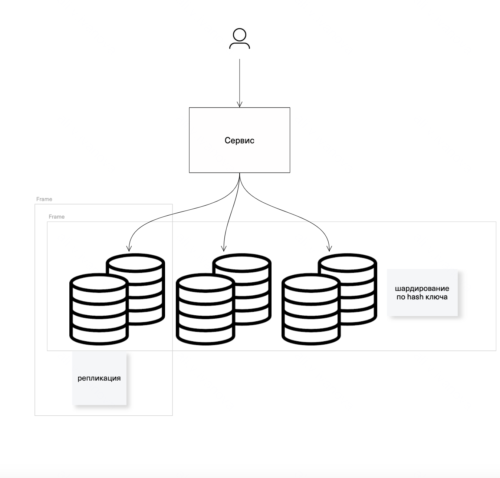
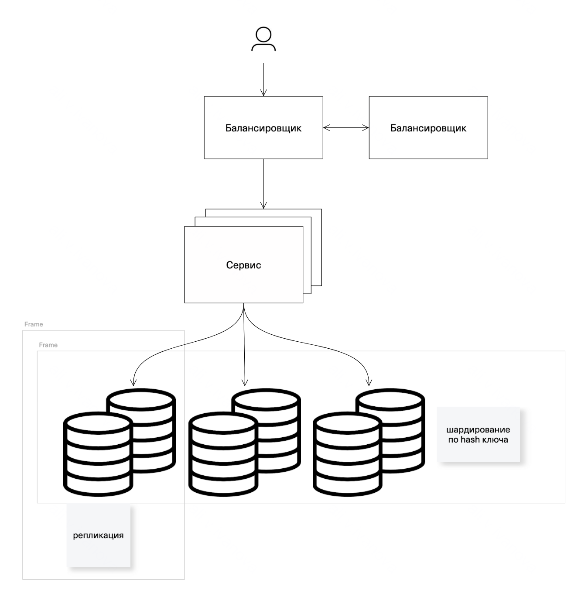

# Производительность и оптимизация

## Цель:

Вам поручено разработать и оптимизировать архитектуру системы, которая должна обрабатывать запросы пользователей с 
минимальной задержкой и высокой доступностью. Система должна быть способна справляться с пиковыми нагрузками, 
обеспечивать отказоустойчивость и предоставлять стабильный уровень производительности. 
Вы также должны провести анализ производительности и предложить улучшения.

## Масштабирование системы:

Построим систему с горизонтальным масштабированием. Это позволит проще масштабировать систему с ростом нагрузки путем 
добавления новых нод и сделает ее более отказоустойчивой за счет того, что при отказе одной из нод ее нагрузка будет 
перераспределяться на остальные.

Как видно на схеме используем шардирование, чтобы распределить нагрузку по шардам, и репликацию для обеспечения 
отказоустойчивости.
В соответвии с CAP теоремой распределенная система может удовлетворять только 2 из 3 свойств: 
С(согласованность), A(доступность), P(устойчивость к распределению).

Т.к. наша система должна обрабатывать запросы с минимальной задержкой и высокой доступностью придется пожертвовать
согласованностью. Таким образом, система будет высокодоступной и отвечать даже при разрывах связи между узлами.

## Обеспечение высокой доступности:

Для обсепечения высокой доступности добавим балансировщик, дополнительный балансировщик на случай выхода из строя первого,
а также несколько нод для сервиса, что обеспечит распределение нагрузки на случай падения ноды. Используем георезервирование 
для распределения нод по разным датацентрам для того, чтобы при выходе из строя одного ДЦ, система в целом осталась доступной.

Сценарии отказов:
1. При отказе БД, запросы перенаправляются на другие реплики. После устранения недоступности инстанса БД, 
на него снова распространяются запросы, за счет репликации инстанс устраняет несогласованность, возникшую при его недоступности.
2. При длительном отказе одной из нод сервиса, балансировщик убивает ее, и перезапускает, на время рестарта запросы перераспределяются на другие инстансы, 
после восстановления ноды, балансировщик переводит на него часть трафика.
3. При отказе одного ДЦ, за счет георезервирования сервис остается доступным. 

## Оптимизация производительности:

Допустим наш сервис реализует стандартный CRUD:

### Создание
`POST /api/requests`

body:

`{ 
    "code" : "code",
    "text" : "text"
}`

Sql-запрос:

`INSERT INTO requests (code, text, user, created_at, updated_at)
VALUES ('code', 'text', 'user')`

### Чтение 

1.1. `GET /api/requests`

Sql-запрос:

`SELECT * from requests`

2.1. `GET /api/requests/{id}`

Sql-запрос:

`SELECT * from requests where id = {id}`

2.2. `GET /api/requests?code={code}`

Sql-запрос:

`SELECT * from requests where code = {code} and user={user}`

### Обновление 
3.1. `PUT /api/requests/{id}`
body:

`{ 
    "code" : "new code",
    "text" : "new text"
}`

Sql-запрос:

`UPDATE requests SET code = 'new code', text = 'new text' WHERE id = {id}`

### Удаление 
4.1. `DELETE /api/requests/{id}`

Sql-запрос:

`DELETE FROM requests where id = {id}`

### Узкие места системы

1. Здесь id - primary key, а значит уже с индексом, поиск по id будет достаточно быстрым.
А вот поиск по code и user (2.2.) приведет к фуллскану, что при разрастании базы может привести к деградации доступности базы.
Для исключения этого на code и user добавим составной индекс.

   `CREATE INDEX idx_code_user ON requests (code, user)`

2. Запросы на чтение (1.1.) сделаем пагинированными, чтобы ограничить поиск и выдавать постраничные результаты.
   

`SELECT * FROM requests
   ORDER BY created_at DESC  
   LIMIT :pageSize OFFSET :offset`

3. На частые запросы добавим кэширование. Добавим redis c небольшим ttl.
4. Следим за частотой vacuum, частый запуском vaccum приведет к увеличению времени простоя.

**Шаблон профиля запросов**

[Шаблон](files/profile_template.md)

